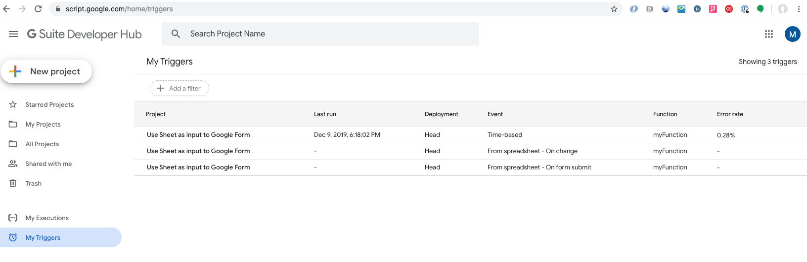

## Google Forms - allow users to update multiple-choice questions
This code can automatically update Google Forms surveys, updating multiple-choice questions with user-submitted answers via the `Other:___` option. 

This uses Google AppEngine Scripts to trigger integrations between Google Forms and Sheets.

All rights belong to _Melinda Waffle_ of [WaffleBytes](http://wafflebytes.blogspot.com/)(See **Authorship**).

### Usage
1. Create a Google Form survey
1. Create a multiple-choice question
1. Dump answers to Google Sheets (Google Forms native support)
1. Use code to consume the Sheets data and update the question with new responses.

For the last step, adjust the included code while following [this helpful guide from the original author](http://wafflebytes.blogspot.com/2018/12/google-script-revisiting-making-form.html)

You will see I adjusted to code to use multiple choice and other light adjustments.

### Use cases and risks
Warning: Automatically trusting user submitted data is risky business. Best used for:
1. small scale surveys
1. trusted users
1. recoverable data
1. non-private data

### Benefits
Updating the options with user submissions allows them to help groom the data. Instead of unknowningly duplicating an earlier write-in, they can see it as a first-class response.

This can be especially helpful for questions with descriptive options, allowing users to screen previous answers for approximations of their response. This is easiest done by the user at survey-time than the author in post!

### Example
For example, "Birth State" could the local state as the sole option, adding additional options only when a user fills in the `Other` field.

```
1. NY
1. Other: _____
```

Once someone from NJ comes along and adds the write-in, the following user should see:

```
1. NY
1. NJ
1. Other: _____
```

I used this script on the key question of my survey, the index of the Sheets with the responses. This allowed users to essentially "vote" for previously submitted answers and greatly inform my understanding of the data.

### Triggers
I used the following triggers to update my survey on read, submission, and time-scheduled. FWICT, it had negligible impact on Form write/performance.


### Authorship
The credit for the idea, workflow, code, and goes solely to Melinda Waffle of wafflebytes.blogspot.com. Waffle Bytes walked me through the whole process, with pictures and code included. The site is regularly updated with GSuite tips and tricks - check it out!

I would like to include the proper licensing infor but Waffle Bytes doesn't support contacting the author or commenting :(
